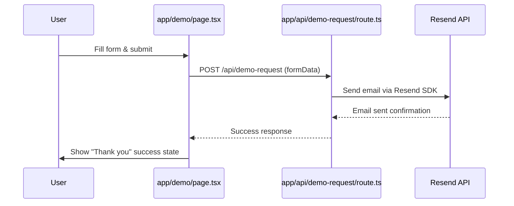

# Plan: Demo Form Email Integration with Resend

## Overview

Implement real form submission from `app/demo/page.tsx` to send email notifications via Resend to `vibhu.athavaria@gmail.com`.

## Architecture



## Todo List

- [ ] **Install Resend SDK** — Add `resend` package to dependencies
- [ ] **Create API route handler** — Create `app/api/demo-request/route.ts` to receive form data and send email via Resend
- [ ] **Update demo page form submission** — Replace simulated submission with actual API call to `/api/demo-request`
- [ ] **Add loading and error states** — Handle loading spinner and error messages in the form
- [ ] **Configure environment variables** — Create `.env.local` with `RESEND_API_KEY` and `DEMO_REQUEST_TO_EMAIL`
- [ ] **Test the integration** — Verify email is received at vibhu.athavaria@gmail.com

## Implementation Details

### 1. Install Resend SDK

```bash
npm install resend
```

### 2. API Route — `app/api/demo-request/route.ts`

Create a POST handler that:
- Receives form data (name, email, school, role, students, curriculum, message)
- Constructs an HTML email template with all form fields
- Sends email via Resend to `vibhu.athavaria@gmail.com`
- Returns success/error response

### 3. Update Form Handler — `app/demo/page.tsx`

Modify [`handleSubmit()`](app/demo/page.tsx:20) to:
- POST formData to `/api/demo-request` instead of simulating
- Handle loading state during API call
- Handle error state if API call fails
- Show success state only after confirmed API response

### 4. Environment Configuration

Create `.env.local` with:
```
RESEND_API_KEY=re_your_api_key_here
DEMO_REQUEST_TO_EMAIL=vibhu.athavaria@gmail.com
```

### 5. User Action Required

You will need to:
1. Create a free Resend account at https://resend.com
2. Generate an API key from the Resend dashboard
3. Add your email (vibhu.athavaria@gmail.com) as a verified recipient in Resend (for testing)

## Files to Modify

| File | Action |
|------|--------|
| `package.json` | Add `resend` dependency |
| `app/api/demo-request/route.ts` | **Create new** — API route handler |
| `app/demo/page.tsx` | **Modify** — Replace simulated submission with API call |
| `.env.local` | **Create** — Environment variables |

## Files to Create

| File | Purpose |
|------|---------|
| `app/api/demo-request/route.ts` | Next.js App Router API route for form submission |
| `.env.local` | Local environment variables (not committed to git) |
